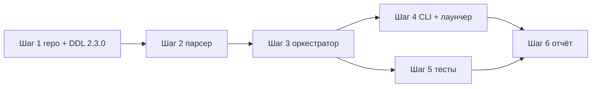

# План работ — Этап 3. Перенос учебных данных из JSON в БД

**Дата:** 2026-09-29
**Источник:** [`plans/database_structure.qmd`](plans/database_structure.qmd:202) (раздел 5, «Этап 3. Перенос учебных данных»)
**Предыдущие шаги:** [`workflow/step_1.md`](workflow/step_1.md) (подключение к PostgreSQL), [`workflow/step_2.md`](workflow/step_2.md) (Этап 2.1, пользователи/JWT), [`workflow/step_3.md`](workflow/step_3.md) (Этап 2.2, схема и справочники)

---

## 1. Постановка задачи

Из [`plans/database_structure.qmd`](plans/database_structure.qmd:202) (Этап 3) требуется:

1. **Проверить наличие данных**, о которых пойдёт речь (каталоги `data/`, `data/curriculum/`,
   файлы `t-*.json`, `s-*.json`, `scenario-*.json`, `training-*.json`, `materials.json`).
2. **`t-*.json` → `task`** (+ `task_dds`, `task_incident_source`). Для заданий `incident-v1`
   заполнить `identity_hash`.
3. **`s-*.json` → `session`** (+ `session_turn`, `session_hint`, `session_card_edit`,
   `session_reveal`, `machine_assessment`, `ai_assessment`/`ai_assessment_field`,
   `teacher_decision`/`teacher_decision_field`).
4. **`curriculum/scenario-*.json` → `scenario` + `scenario_task`.**
5. **`curriculum/training-*.json` → `training` + `training_scenario` + `training_participant` +
   `training_card` (+ `training_service_action`).**
6. **`curriculum/materials.json` → `material`.**
7. **Строковые имена студентов/преподавателей**: создать/найти записи `user`
   (сгенерированный login), связать по `display_name`, сохранить связь в отдельную таблицу
   соответствий на время переходного периода.

### ВАЖНО
- Таблицы этапа 2.2 уже существуют (версия схемы `2.2.0`) — **этот этап не пересоздаёт их**,
  только наполняет. Новым является лишь одна таблица соответствий имён `legacy_name_map`
  (версия схемы `2.3.0`).
- Приложение на этом этапе **продолжает работать с JSON-файлами** (переключение репозитория —
  Этап 5). Импорт — односторонний: файлы → БД.
- REST/UI для учебных данных **не добавляются** (это объём Этапа 5); этап закрывается
  консольным инструментом импорта + самопроверками.

---

## 2. Текущее состояние и переиспользуемые заделы

| Что уже есть | Где | Как используем |
|---|---|---|
| Wire-клиент PostgreSQL: `execute`/`fetchone`/`quote_literal`/`transaction`, булевы `'t'/'f'`, чтение jsonb как текста | [`db_connection.py`](db_connection.py) | Без изменений |
| Таблицы `user`, `student_group`, `group_member`, `auth_session`, `schema_migration` (v2.1.0) | [`auth_repository.py`](auth_repository.py:22) | Для маппинга имён; `user.display_name` уже nullable |
| Все таблицы раздела 2 (v2.2.0): `task`, `session`, `scenario`, `training`, ... | [`catalog_repository.py`](catalog_repository.py:25) | Наполняем данными; DDL не трогаем |
| Хэширование паролей PBKDF2, `hash_password` | [`auth_crypto.py`](auth_crypto.py), [`auth_service.py`](auth_service.py:13) | Для паролей импортированных пользователей |
| Паттерн инициализации: `SCHEMA_STATEMENTS` + `ensure_schema()` + версия в `schema_migration`; CLI `--init/--check/--self-test/--pause`; `TEST_*.cmd`; некритичный шаг в лаунчере | [`init_auth.py`](init_auth.py), [`init_catalog.py`](init_catalog.py), [`START_ALL.ps1`](START_ALL.ps1) | Копируем: `init_training_data.py` + `TEST_DATA.cmd` + шаг в лаунчере |
| Транзакционная перезапись порциями (стратегия импорта справочников) | [`catalog_repository.py`](catalog_repository.py:563) (`replace_classifier`) | Аналогично для учебных данных |
| Тестовые каркасы: unit без БД, integration со скипом при недоступности БД | [`tests/test_catalog_importer.py`](tests/test_catalog_importer.py), [`tests/test_catalog_integration.py`](tests/test_catalog_integration.py) | Аналогичные `test_training_data_*.py` |
| Примеры форматов файлов: legacy-задание, dds-задание, публикация incident-v1 | [`sample.json`](sample.json), [`sample_dds.json`](sample_dds.json), [`incident_training.py`](incident_training.py:26) | Эталоны для парсера и тест-фикстур |

### Ограничение окружения
Каталог `data/` находится в `.codeassistantignore` — он **недоступен инструментам агента**
(чтение/поиск). Проверка наличия и чтение файлов выполняются **самим импортёром** (Python-код,
запускаемый через `execute_command`), а не инструментами редактора. Форматы файлов
задокументированы в разделе 4 по исходникам приложения; финальная сверка — на живом стенде.

---

## 3. Ключевые проектные решения

1. **Версия схемы `2.3.0`.** Новый модуль `training_data_repository.py` содержит
   `SCHEMA_STATEMENTS` только для новой таблицы соответствий имён `legacy_name_map` (см. п. 4.7)
   и `ensure_schema()` — по образцу [`auth_repository.ensure_schema`](auth_repository.py:98),
   идемпотентно, фиксирует версию `2.3.0`. Остальные таблицы уже созданы этапом 2.2.

2. **Стратегия импорта — «полная перезапись» в одной транзакции** (как справочники в Этапе 2.2).
   Источник истины на этом этапе — JSON-файлы, приложение пишет только в файлы, поэтому
   `TRUNCATE ... RESTART IDENTITY CASCADE` учебных таблиц + повторная вставка безопасны и
   дают идемпотентность. Повторный запуск воспроизводим. **Таблицы `user`, справочники
   и служебные (`ai_generation_log`, `insight_report`) не затрагиваются.**

3. **Импортированные пользователи создаются один раз и никогда не удаляются импортом.**
   Поиск существующего — по `user.display_name` (нормализованное сравнение) и по
   `legacy_name_map`; не найдено → `create_user` с сгенерированным логином, случайным
   паролем (PBKDF2 через [`auth_crypto.hash_password`](auth_crypto.py)) и `display_name`
   = исходное имя. Список созданных логинов выводится в отчёт; пароли не печатаются —
   администратор выдаёт доступ через админку (`PUT /auth/users/{id}` поддерживает
   смену пароля, [`auth_service.update_user`](auth_service.py:185)).

4. **Приоритет ролей при конфликте имени.** Если одно и то же имя встречается и как студент
   (`session.student`, участник тренировки), и как преподаватель (`task.approved_by`,
   `scenario.created_by/approved_by`, `training.teacher`, `material.teacher`,
   `session.teacher_note_by`, `teacher_decision.teacher`) — создаётся **один** `user`
   с ролью более высокого приоритета (`teacher` > `student`), обе роли фиксируются в
   `legacy_name_map` (записи с `kind='teacher'` и `kind='student'` на один `user_id`).

5. **`identity_hash` — полный SHA-256 содержимого, только для `incident-v1`.** Для заданий,
   опубликованных через [`incident_training.publish`](incident_training.py:26), хэш считается
   по тому же сериализуемому кортежу, что и идентификатор `t-...`:
   `sha256(json.dumps([content, reference, caller_scenario, opening, level],
   ensure_ascii=False, sort_keys=True)).hexdigest()` (в `publish` используется префикс
   `[:12]` для `id`; в БД храним **полный** 64-символьный хэш). Для legacy-заданий —
   `NULL` (документ требует хэш только для `incident-v1`; уникальный индекс допускает
   несколько NULL).

6. **Снимки и неизменяемость соблюдаются.** `session.task_snapshot` = полная копия `task`
   из файла сессии (аналог `copy.deepcopy` в [`ai_core.py`](ai_core.py:143)),
   `session.reference_hash` переносится как есть. Это гарантирует согласованность
   с проектной моделью (раздел 4, решение №2).

7. **Правило доставки реплик `delivered`.** В истории ДДС потерянные реплики имеют
   `delivered=''` и/или `delivery='lost'` ([`dds.py`](dds.py:117)); частично доставленные —
   `delivery='partial'` с фрагментом в `delivered` ([`dds.py`](dds.py:125)). Маппинг:
   `session_turn.text` = **исходный** текст реплики, `session_turn.delivered` =
   `false` только при `delivery='lost'` или `delivered == ''`, иначе `true`;
   в `event` сохраняем `channel_lost`/`channel_partial`, если они были. Полный
   доставленный фрагмент в отдельную колонку не выносится (так спроектирована схема
   раздела 2.5); при необходимости точный фрагмент восстанавливается из файла.

8. **Нормализация времени.** Даты в JSON — ISO-строки `datetime.now(timezone.utc).isoformat()`
   (с `+00:00`). Если строка без смещения — добавляем `+00:00` перед вставкой в
   `timestamptz`, чтобы исключить зависимость от TZ сервера Postgres.

9. **Сессии без задания.** Если `session.task.id` отсутствует среди импортируемых
   `t-*.json` (повреждённый файл), такая сессия **пропускается с предупреждением**
   (иначе падение FK `task_id ... ON DELETE RESTRICT`). В отчёт выводится список
   пропущенных id. Аналогично для `scenario.task_ids`, `training.card.task_id`.

10. **В лаунчер добавляется только проверка, не импорт.** Полный `--init` выполняется
    вручную (`TEST_DATA.cmd`): перезапись учебных данных на каждом старте приложения
    нежелательна (позже БД станет источником истины). В `START_ALL.ps1` — некритичный
    шаг `init_training_data.py --check` с логом `.runtime\training-data-init.log`.

11. **Объём порциями.** Вставки выполняются одной транзакцией батчами (например, по 200
    строк) через Simple Query + `quote_literal()` — как массовый импорт справочников
    в Этапе 2.2 (задел Extended Query остаётся на будущее).

---

## 4. Маппинг файловых форматов → таблицы БД

> Ниже — точные соответствия полей. Значения JSONB переносятся как есть (Python-объект
> сериализуется в `json.dumps(..., ensure_ascii=False)`); булевы PostgreSQL получаются
> текстом `'t'/'f'` — конвертация через `_as_bool()` как в
> [`catalog_repository.py`](catalog_repository.py:511).

### 4.1 `t-*.json` → `task` (+ `task_dds`, `task_incident_source`)

Формат файла описан в [`ai_core.py`](ai_core.py:56) (`Engine.save/load`), [`sample.json`](sample.json),
[`sample_dds.json`](sample_dds.json) и [`incident_training.publish`](incident_training.py:44).

| Поле JSON | Колонка БД | Комментарий |
|---|---|---|
| `id` | `task.id` | PK, `t-…` |
| `title` | `task.title` | |
| `status` | `task.status` | `draft`/`approved`, CHECK совпадает |
| `workflow` | `task.workflow` | `caller`/`dds`; default `caller` |
| `level` | `task.level` | |
| `format` | `task.format` | `'incident-v1'` если `task.get('format')=='incident-v1'`, иначе `'legacy'` |
| `opening` | `task.opening` | |
| `persona` | `task.persona` | |
| `fields` | `task.fields` (jsonb) | целиком |
| `field_labels` | `task.field_labels` (jsonb) | default: `FIELDS` из [`ai_core.py`](ai_core.py:13) для legacy |
| `source` | `task.source` | `'ai'`/`'sample'`/`'approved-workshop-card'`/… |
| — | `task.identity_hash` | только для `incident-v1`, см. решение №5 |
| `approved_by` (строка) | `task.approved_by_id` | маппинг имени → `user` (решение №3–4) |
| `approved_at`, `created_at`, `updated_at` | одноимённые колонки | нормализация TZ (решение №8) |

Для `workflow == 'dds'` (поля из [`dds.dds_schema`](dds.py:13) и [`sample_dds.json`](sample_dds.json)):

| Поле JSON | Колонка `task_dds` |
|---|---|
| `incoming_card` | `incoming_card` (jsonb) |
| `verification_notes` | `verification_notes` |
| `faults` | `faults` |
| `service.name` / `service.role` / `service.knowledge` | `service_name` / `service_role` / `service_knowledge` |
| `actions` | `actions` (jsonb) |

Для `format == 'incident-v1'` (поля из [`incident_training.publish`](incident_training.py:52)):

| Поле JSON | Колонка `task_incident_source` |
|---|---|
| `incident_source` | `content` (jsonb) |
| `incident_reference` | `reference` (jsonb) |
| `caller_scenario` | `caller_scenario` (jsonb) |
| `opening` | `opening` |

### 4.2 `curriculum/scenario-*.json` → `scenario` + `scenario_task`

Формат из [`curriculum.save_scenario`](curriculum.py:67):

| Поле JSON | Колонка БД |
|---|---|
| `id`, `title`, `description`, `status`, `created_at`, `updated_at` | `scenario.*` |
| `created_by` (строка) | `scenario.created_by_id` |
| `approved_by` (строка) | `scenario.approved_by_id`; `approved_at` → `approved_at` |
| `task_ids[]` × `task_difficulties{id:1..5}` | `scenario_task(scenario_id, task_id, difficulty)`; default difficulty 3 |

### 4.3 `curriculum/training-*.json` → `training` + связанные

Формат из [`curriculum.save_training`](curriculum.py:127) и [`curriculum.activate`](curriculum.py:155):

| Поле JSON | Колонка БД |
|---|---|
| `id`, `title`, `description`, `status`, `mode`, `seconds`, `difficulty`, `created_at`, `started_at`, `completed_at`, `updated_at` | `training.*` |
| `group` (строка) | `training.group_name` |
| `teacher` (строка) | `training.teacher_id` |
| `scenario_ids[]` | `training_scenario(training_id, scenario_id)` |
| `participants[]` → `{student, role, service}` | `training_participant(training_id, user_id, role, service_code=service)`; `user_id` — по имени `student` |
| `cards[]` → см. ниже | `training_card.*` + `training_service_action` |

`cards[]` (из [`curriculum.activate`](curriculum.py:180) и операций [`curriculum.py`](curriculum.py:222)):

| Поле JSON (record) | Колонка `training_card` |
|---|---|
| `id` | `id` (PK, `card-…`) |
| — | `training_id` (из файла тренировки) |
| `task_id` | `task_id` (FK; отсутствие задачи — пропуск с предупреждением) |
| `operator_session_id` | `operator_session_id` |
| `status` | `status` (CHECK: awaiting_call/operator_work/dds_review/service_review/done/stopped) |
| `card` | `card_snapshot` (jsonb) |
| `services` | `services` (jsonb) |
| `submitted_at` | `submitted_at` |
| `dds_by` (строка) | `dds_by_id` (маппинг имени) |
| `routed_at` | `routed_at` |
| `service_actions{code:{student,text,at}}` | `training_service_action(training_card_id, service_code, text, at)` |

### 4.4 `curriculum/materials.json` → `material`

Формат из [`materials.add`](materials.py:20): список записей
`{id, title, url, description, teacher, created_at}` →
`material(id, title, url, description, teacher_id=маппинг(teacher), created_at)`.

### 4.5 `s-*.json` → `session` + оценивание

Формат из [`ai_core.Engine.start`](ai_core.py:139) (базовый скелет), [`submit`](ai_core.py:236),
[`assess`](ai_core.py:246), [`finalize`](ai_core.py:305), [`finalize_percent`](ai_core.py:324),
[`incident_training.initialize`](incident_training.py:58), [`training_progress.coaching_nudge`](training_progress.py:93),
[`teacher_portal.teacher_note`](teacher_portal.py:57).

| Поле JSON | Колонка БД |
|---|---|
| `id` | `session.id` (PK, `s-…`) |
| `task.id` | `session.task_id` (FK) |
| `task` (копия) | `session.task_snapshot` (jsonb) |
| `reference_hash` | `session.reference_hash` |
| `student` (строка) | `session.student_id` (маппинг имени) |
| `status` | `session.status` (queued/awaiting_call/active/submitted/pending_teacher/reviewed) |
| `effective_level` | `session.effective_level` |
| `card` | `session.card` (jsonb) |
| `training` | `session.training_meta` (jsonb) |
| `callback_disclosed` | `session.callback_disclosed` (bool) |
| `connection` | `session.connection` |
| `call_attempts` | `session.call_attempts` (int) |
| `next_channel` | `session.next_channel` |
| `timed_out` | `session.timed_out` (bool) |
| `forced_finish` | `session.forced_finish` (jsonb) |
| `teacher_note`, `teacher_note_by`, `teacher_note_at` | `session.teacher_note`, `teacher_note_by_id`, `teacher_note_at` |
| `created_at`, `activated_at`, `submitted_at`, `updated_at` | одноимённые колонки |

Дочерние коллекции:

| Поле JSON | Таблица БД | Маппинг |
|---|---|---|
| `history[]` | `session_turn` | `turn_no=id`, `role`, `text`, `source` (`'text'` если нет), `event`, `delivered` (решение №7), `at` |
| `hints[]` | `session_hint` | `text`, `at` |
| `card_edits[]` | `session_card_edit` | `field`, `before`, `after`, `at` |
| `training_reveals[]` | `session_reveal` | `field`, `label`, `value`, `number`, `at` |
| `machine_assessment` | `machine_assessment` | `percent`, `compared`, `method`, `fields`, `at` |
| `assessment` | `ai_assessment` + `ai_assessment_field` | `summary`, `percent`, `reference_hash`, `status='ready'`, `created_at=at`; `fields{}` → строки: `field`, `verdict`, `comment`, `clarification`, `citation_warning` (bool → `'true'/'false'`), `evidence` (jsonb) |
| `teacher_decision` | `teacher_decision` + `teacher_decision_field` | `teacher_id=маппинг(teacher)`, `grade`, `percent`, `conclusion`, `created_at=at`; `fields{}` → строки: `field`, `decision` (default `'agree'` для `finalize_percent`, где поле только `{comment}`), `comment` |

### 4.6 Маппинг строковых имён → `user` (решения №3–4)

Источники имён:

| Роль | Где встречается имя |
|---|---|
| student | `session.student`; `training.participants[].student` (все роли: operator/dds/service) |
| teacher | `task.approved_by`; `scenario.created_by`/`approved_by`; `training.teacher`; `material.teacher`; `session.teacher_note_by`; `teacher_decision.teacher` |

Правила:
- Нормализация: `strip()`, `casefold()` для сравнения; в БД `display_name`/`full_name`
  сохраняем исходное написание первого вхождения.
- Логин: читаемый, из имени (транслитерация кириллицы в латиницу простым словарём,
  `snake_case`), при коллизии — суффикс `-2`, `-3`…; если имя пустое/нечитаемое —
  `student-<hex4>`/`teacher-<hex4>`.
- Пароль: `secrets.token_urlsafe(9)` → `hash_password()` (не менее 6 символов — требование
  [`auth_service.create_user`](auth_service.py:168)).
- Каждая пара (имя, роль) получает строку в `legacy_name_map`.

### 4.7 Новая таблица `legacy_name_map` (DDL в `training_data_repository.py`)

```sql
CREATE TABLE IF NOT EXISTS legacy_name_map (
    id         bigint GENERATED ALWAYS AS IDENTITY PRIMARY KEY,
    name       text NOT NULL UNIQUE,
    user_id    bigint NOT NULL REFERENCES "user"(id) ON DELETE CASCADE,
    kind       text NOT NULL DEFAULT 'student'
               CHECK (kind IN ('student', 'teacher')),
    created_at timestamptz NOT NULL DEFAULT now()
);
CREATE INDEX IF NOT EXISTS idx_legacy_name_map_user ON legacy_name_map(user_id);
```

`UNIQUE(name)` покрывает оба kind — одна строка на имя; при конфликте ролей `kind`
перезаписывается на `teacher` (высший приоритет). Таблица служит для обратной
совместимости в переходный период (Этап 5) и затем может быть удалена.

---

## 5. Состав работ по шагам

### Шаг 1. Модуль репозитория — `training_data_repository.py`
- `SCHEMA_STATEMENTS` для `legacy_name_map`, `SCHEMA_VERSION = '2.3.0'`, `ensure_schema()`
  (по образцу [`catalog_repository.ensure_schema`](catalog_repository.py:495)).
- Методы вставки батчами (200 строк): `insert_tasks`, `insert_scenarios`,
  `insert_trainings`, `insert_sessions`, `insert_materials`; подсчёт `count(*)` по каждой
  таблице для `--check`/`--self-test`.
- Метод `replace_all(tables)` — `TRUNCATE <учебные таблицы> RESTART IDENTITY CASCADE`
  одной транзакцией (список таблиц: `session_*`, `task_*`, `scenario*`, `training*`,
  `material`, `machine_assessment`, `ai_assessment*`, `teacher_decision*`,
  `legacy_name_map`; **не** `user`, справочники, `ai_generation_log`, `insight_report`).
- Методы работы с `user`: `find_by_display_name(name)`, `create_imported_user(...)`,
  `upsert_legacy_name(name, user_id, kind)`.

### Шаг 2. Чистый парсер файлов — `training_data_importer.py` (без БД)
- `scan(directory) -> Report`: проверка наличия `data/`, `data/curriculum/`;
  списки файлов `t-*.json`, `s-*.json`, `scenario-*.json`, `training-*.json`,
  `materials.json`; количества. Пусто/нет каталога → `available=False`.
- `parse_task(file) -> (task_row, dds_row|None, incident_row|None)`;
  `parse_session(file) -> (session_row, children[])`;
  `parse_scenario`, `parse_training`, `parse_materials` — по таблицам раздела 4.
- Вспомогательные: `normalize_ts(value)`, `delivered_flag(row)`,
  `compute_identity_hash(task)` (решение №5), `collect_names(report) -> {(name, kind)}`.
- Валидация на лету: неправильный id, битые JSON — запись в `errors[]`, файл пропускается.

### Шаг 3. Оркестратор — `training_data_service.py`
- `import_all(directory) -> Result`: последовательность (решение №2):
  1. `ensure_schema()` (v2.3.0);
  2. `replace_all(...)` — очистка;
  3. сбор имён → `resolve_users(names)` (создание/поиск, решения №3–4) + `legacy_name_map`;
  4. вставка задач → сценариев → тренировок → сессий → материалов (порядок важен:
     `task` раньше `scenario_task`/`session`; `scenario` раньше `training_scenario`);
  5. итоговый отчёт: количества по таблицам, созданные пользователи, пропущенные записи.
- Единая транзакция на весь импорт; при ошибке — откат и понятное сообщение.

### Шаг 4. CLI и интеграция — `init_training_data.py` + `TEST_DATA.cmd` + лаунчер
- `python init_training_data.py --init [--dir PATH] --check --self-test --pause` (exit 0/2),
  по образцу [`init_catalog.py`](init_catalog.py):
  - `--check`: сканирование каталогов (пункт «проверить наличие данных») + сверка
    `schema_migration` (2.2.0/2.3.0) + количества строк в учебных таблицах;
  - `--init`: полный импорт (перезапись);
  - `--self-test`: выборка из каждой учебной таблицы, проверка FK-связок
    (session→task, training_card→training/task), последовательность `turn_no`.
- `TEST_DATA.cmd` по образцу [`TEST_CATALOG.cmd`](TEST_CATALOG.cmd).
- [`START_ALL.ps1`](START_ALL.ps1): некритичный шаг **«Checking the training data layer…»**
  с `--check` (решение №10), лог `.runtime\training-data-init.log`, зелёный/жёлтый вывод.

### Шаг 5. Тесты
- Unit (без БД): `tests/test_training_data_importer.py` — парсинг фикстур всех пяти видов
  (синтетические, по образцу [`sample.json`](sample.json)/[`sample_dds.json`](sample_dds.json)
  и реальному скелету сессии из [`ai_core.start`](ai_core.py:139)); `identity_hash`;
  `delivered_flag`; нормализация времени; сбор имён и приоритеты ролей.
- Integration (живая БД, скип при недоступности): `tests/test_training_data_integration.py` —
  импорт фикстур: counts, идемпотентность (повторный `--init` не дублирует), пользователи
  создаются один раз, `legacy_name_map`, FK-целостность, сессии с пропущенными заданиями
  не роняют импорт.
- Регрессия: `python -m unittest discover -s tests -p "test_*.py"` (ожидаем только известные
  падения `test_multi_provider` по окружению — [`workflow/step_2.md`](workflow/step_2.md:135));
  `py_compile` изменённых модулей; PowerShell-парсер для `START_ALL.ps1`.
- Живой прогон на стенде: `TEST_DATA.cmd` против реальных `data/*.json`.

### Шаг 6. Документация
- Отчёт [`workflow/step_4.md`](workflow/step_4.md) по образцу предыдущих (дата, модель, статус,
  решения, таблицы, проверки, «как запустить», ограничения, что дальше). В отчёте —
  реальные количества импортированных файлов/строк.
- Обновить статус Этапа 3 в [`plans/database_structure.qmd`](plans/database_structure.qmd:202).

---

## 6. Порядок выполнения и зависимости



- Шаг 1 опирается на `db_connection` и паттерны auth/catalog; проверяется консольно.
- Шаг 2 независим от БД и тестируется unit-тестами до написания оркестратора.
- Шаг 3 зависит от Шагов 1–2; Шаг 4 — от Шага 3; Шаг 5 — параллельно с 3–4;
  финальный прогон — после Шага 4 (живые данные на стенде).
- Просмотр учебных данных в админке/REST — **не входит** в этап (Этап 5, переключение
  репозитория).

---

## 7. Риски и открытые вопросы

| № | Риск/вопрос | Митигация/решение |
|---|---|---|
| 1 | `data/` скрыта инструментами агента (`.codeassistantignore`) | Импортёр читает файлы напрямую (Python); парсеры пишутся по форматам из кода (раздел 4); финальная сверка — `TEST_DATA.cmd` на стенде. При необходимости пользователь кладёт пример файла в `tests/fixtures/` вручную |
| 2 | Данные могут отсутствовать (пустой `data/`) | `--check` сообщает «нет данных для импорта», exit 2; `--init` не создаёт пустые таблицы молча — требует подтверждения/отчёта |
| 3 | Сессии ссылаются на отсутствующие задания | Пропуск с предупреждением (решение №9), список в отчёте |
| 4 | Одно имя в ролях student и teacher | Один `user`, роль по приоритету, обе связи в `legacy_name_map` (решение №4) |
| 5 | Повторный `--init` стирает изменения, внесённые в БД между запусками | На этом этапе приложение пишет только в файлы — перезапись безопасна; документируется, что стратегия сменится на Этапе 5 |
| 6 | Потеря точного фрагмента частично доставленной реплики (`delivery='partial'`) | Схемой предусмотрен только boolean `delivered`; исходный текст сохраняется, фрагмент восстанавливаем из файла при аудите (решение №7) |
| 7 | Пароли импортированных пользователей неизвестны | Случайные пароли + `display_name`; администратор выдаёт доступ через `PUT /auth/users/{id}` (смена пароля уже реализована) |
| 8 | Часть legacy-заданий может не иметь `field_labels`/`level` | Defaults: `field_labels=FIELDS`, `level=NULL` допустим; CHECK-ограничений на `level` нет |
| 9 | Объём импорта (тысячи сессий × реплики) в одной транзакции | Батчи по 200 строк внутри единой транзакции; при превышении лимитов — разбивка транзакций по видам сущностей |
| 10 | Булевы и jsonb приходят из Postgres текстом | Переиспользуем `_as_bool`/`_json` из [`catalog_repository.py`](catalog_repository.py:511) (вынести в общий хелпер при необходимости) |

---

## 8. Критерии готовности (Definition of Done)

- [ ] Проверка наличия данных: `init_training_data.py --check` корректно сообщает о файлах
      `t-*/s-*/scenario-*/training-*/materials.json` и их количестве (или об их отсутствии).
- [ ] Схема `2.3.0` зафиксирована в `schema_migration`; создана `legacy_name_map`;
      повторный `ensure_schema()` безопасен.
- [ ] Импорт `--init` заполняет: `task` (+ `task_dds`, `task_incident_source`),
      `session` (+ 8 дочерних таблиц), `scenario`+`scenario_task`,
      `training`+`training_scenario`+`training_participant`+`training_card`
      (+`training_service_action`), `material` — с подсчётом строк по каждой таблице.
- [ ] Для заданий `incident-v1` заполнен уникальный `identity_hash` (полный SHA-256);
      повторная публикация той же карточки не создаёт дубля.
- [ ] Имена студентов/преподавателей разрешены в `user` (роль по приоритету, уникальный
      login, `display_name` = исходное имя); все связи зафиксированы в `legacy_name_map`;
      список созданных логинов выведен в отчёт.
- [ ] Повторный `--init` идемпотентен: количества строк не меняются, дубли не создаются,
      пользователи не задваиваются.
- [ ] Unit- и интеграционные тесты зелёные; регрессия не хуже состояния до этапа
      (ожидаемы только известные падения `test_multi_provider`).
- [ ] `START_ALL.ps1` содержит некритичный шаг проверки учебных данных с логом
      `.runtime\training-data-init.log`.
- [ ] Отчёт [`workflow/step_4.md`](workflow/step_4.md) написан; статус Этапа 3 в
      [`plans/database_structure.qmd`](plans/database_structure.qmd:202) обновлён.