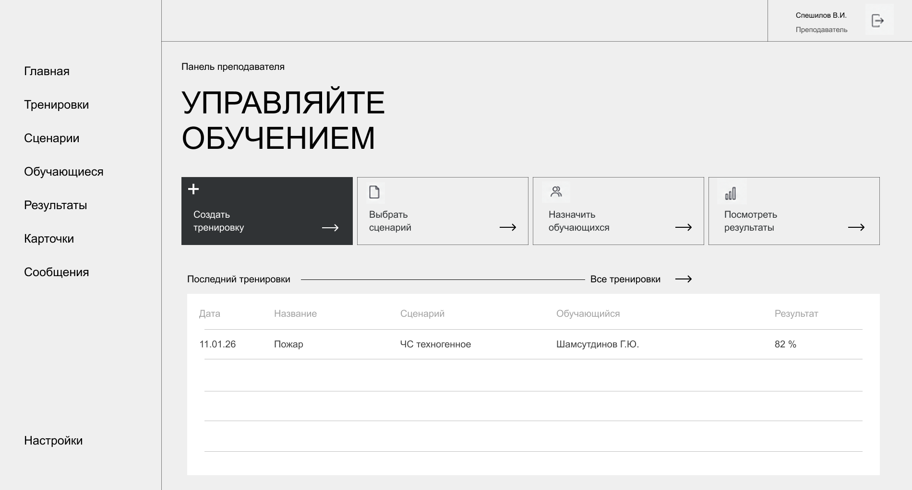

# Кейс 09 · Учебный симулятор подготовки диспетчеров экстренных служб (Система-112)

> Хакатон «Лидеры цифровой трансформации» (ЛЦТ) 2026 — конкурс Мэра Москвы для лучших ИТ-специалистов мира.

Репозиторий проекта для хакатона Лидеры цифровой трансформации от команды **"Игры и теория"**

## Состав репозитория

Папки проекта:

- *output_docs*: документы которые будут сформированы по итогам работы (отчет, преза и т.д.)
- *TZ*: техническое задание и исходные данные (датасеты и т.д.)
- *workflow*: разные сопровождающие разработку документы (например идеи)
- *database*: база данных
- *frontend*: фронтенд
- *backend*: бэкенд (*возможно будет объединен с database*)

## UX Flow

> Пользовательский сценарий системы: преподаватель → создание тренировки → выбор сценария → запуск → работа обучающегося → обработка и сохранение результатов.

## Панель преподавателя

🎨 [**Дизайн и UX-макеты в Figma**](https://www.figma.com/design/DuyF0x3DrhDdApa4AR3HTG/Hackathon?node-id=0-1)

## База данных

Модуль базы данных тренажёра ДДС «Система-112» находится в папке
[`database`](database/README.md).
