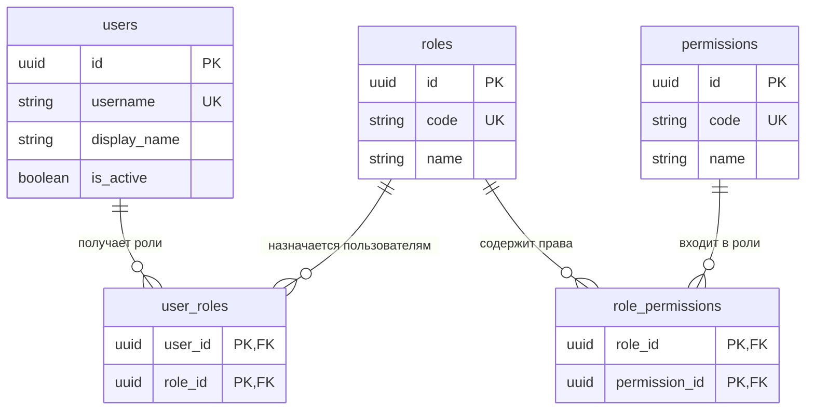
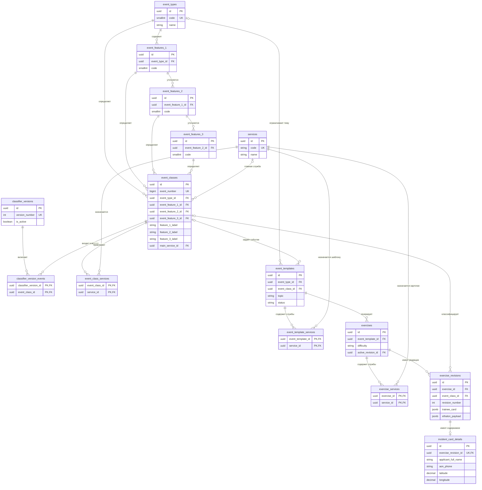

# Краткое описание базы данных тренажёра «Система-112»

База данных работает на PostgreSQL и разделена на пять прикладных схем.
Внутренние идентификаторы основных объектов имеют тип UUID. Карточка получает
официальный номер из классификатора, поэтому отдельный номер в содержимом
карточки не дублируется.

## Схемы и таблицы

### `auth` — пользователи и доступ

- `users` — администраторы, преподаватели и обучающиеся;
- `roles` — роли пользователей;
- `permissions` — разрешения;
- `user_roles` — назначение нескольких ролей пользователю;
- `role_permissions` — разрешения, входящие в роль.

### `catalog` — классификатор и службы

- `event_types` — верхний уровень классификатора, код `Г`;
- `event_features_1` — первый признак;
- `event_features_2` — второй признак;
- `event_features_3` — третий признак;
- `event_classes` — допустимые комбинации признаков и номера событий;
- `services` — справочник экстренных и городских служб;
- `event_class_services` — службы, привлекаемые к событию;
- `classifier_versions` — опубликованные версии классификатора;
- `classifier_version_events` — состав каждой версии классификатора.

Номер события рассчитывается автоматически:

```text
Г × 1 000 000 + признак 1 × 10 000 + признак 2 × 100 + признак 3
```

В `event_types.name` хранится расшифровка группы происшествия `Г`. Поля
`event_classes.feature_1_label`, `feature_2_label` и `feature_3_label`
сохраняют точные расшифровки признаков конкретного события. Они могут
отличаться у разных комбинаций кодов, поэтому не вычисляются по одному коду
признака. Отсутствующая расшифровка хранится как `NULL`.

### `content` — шаблоны и карточки

- `event_templates` — темы и инструкции для генерации карточек;
- `event_template_services` — службы шаблона;
- `exercises` — карточки банка заданий и уровень сложности;
- `exercise_services` — службы конкретной карточки;
- `exercise_revisions` — редакции, эталон, предложение GigaChat и проверка;
- `incident_card_details` — заявитель, три телефона, адрес, координаты,
  описание происшествия, сведения ВИС и контроль.

Одна редакция имеет не более одного набора `incident_card_details`. Номер
карточки получается через `exercise_revisions.event_class_id` и
`event_classes.event_number`.

### `training` — прохождение и оценка

- `scoring_profiles` — наборы правил оценки;
- `scoring_rules` — правила для каждого уровня сложности;
- `sessions` — учебные сессии;
- `session_cards` — карточки, выданные в сессии;
- `answers` — ответы обучающихся;
- `evaluations` — правильность, время, применённые правила и итоговый балл.

### `audit` — журнал действий

- `audit_log` — действия пользователей и изменения объектов. Записи журнала
  хранятся шесть месяцев.

### `public` — служебная схема

- `alembic_version` — текущая версия миграций. Таблицу нельзя изменять вручную.

## Связи пользователей и прав



## Связи классификатора и карточек



## Связи учебного процесса и аудита

```mermaid
erDiagram
    users o|--o{ classifier_versions : "публикует"
    users o|--o{ event_templates : "создаёт"
    users o|--o{ exercises : "создаёт и утверждает"
    users o|--o{ exercise_revisions : "создаёт и проверяет"
    users o|--o{ scoring_profiles : "создаёт"

    scoring_profiles ||--o{ scoring_rules : "содержит"
    scoring_profiles o|--o{ sessions : "оценивает"
    classifier_versions o|--o{ sessions : "фиксируется в"
    users ||--o{ sessions : "проходит или контролирует"

    sessions ||--o{ session_cards : "содержит"
    exercise_revisions ||--o{ session_cards : "выдаётся в сессии"
    session_cards ||--o| answers : "получает ответ"
    answers ||--o| evaluations : "оценивается"
    users o|--o{ audit_log : "совершает действие"

    scoring_profiles {
        uuid id PK
        string name UK
        boolean is_default
    }
    scoring_rules {
        uuid id PK
        uuid profile_id FK
        string difficulty
        decimal correctness_threshold
        int half_life_seconds
    }
    sessions {
        uuid id PK
        uuid trainee_id FK
        uuid teacher_id FK
        uuid scoring_profile_id FK
        uuid classifier_version_id FK
        string status
    }
    session_cards {
        uuid id PK
        uuid session_id FK
        uuid exercise_revision_id FK
        int sequence_number
        string status
    }
    answers {
        uuid id PK
        uuid session_card_id UK, FK
        jsonb payload
    }
    evaluations {
        uuid id PK
        uuid answer_id UK, FK
        decimal accuracy_percent
        decimal total_score
        string next_difficulty
    }
    audit_log {
        uuid id PK
        uuid actor_id FK
        string action
        string entity_type
        uuid entity_id
    }
    users {
        uuid id PK
    }
    classifier_versions {
        uuid id PK
    }
    event_templates {
        uuid id PK
    }
    exercises {
        uuid id PK
    }
    exercise_revisions {
        uuid id PK
    }
}
```

## Удаление и история

Пользователи, события, службы, шаблоны, карточки, профили оценки и учебные
сессии сначала помечаются удалёнными. Поле `purge_after` назначает физическое
удаление через шесть месяцев. Зависимые записи удаляются каскадно только после
окончательного удаления родительского объекта.
