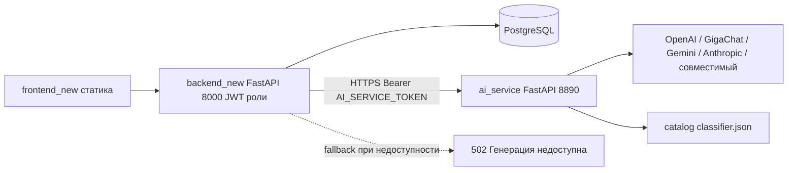

# План работ №3 — ревизия плана №2 и отдельный ИИ-микросервис

Источник: ревизия [`plan2_my.md`](../plan2_my.md) по состоянию проекта
(2026-09-28) + новое решение: ИИ-ядро выносится в отдельный микросервис,
работающий по логике standalone-проекта «ИИ для проекта (2)».

## 1. Ревизия plan2_my.md — актуальность пунктов

| № | Пункт исходного плана | Статус | Комментарий по факту в проекте |
|---|---|---|---|
| 1 | Перенести ИИ-ядро в backend_new (`app/services/ai/`) | ✅ Выполнен | Ядро на месте: `provider.py`, `ai_core.py`, `card_factory.py`, `card_caller.py`, `card_reference.py`, `dds.py`, `mapping.py`, `schemas.py`, `service.py`, `catalog/classifier.json`, `certs/`. Настройки в [`config.py`](../backend_new/app/core/config.py:30) и `.env` (`AI_PROVIDER`, `AI_API_KEY`, …). Ключ не попадает в браузер. |
| 2 | Реализовать ИИ-endpoints в backend_new | 🔶 Частично | Backend-часть готова: 8 endpoints в [`ai.py`](../backend_new/app/api/v1/ai.py:33) (`/system/ai/status`, `generate`, `reference-preview`, `caller-reply`, `validate-fields`, `service-reply`, `ai-eval`), заглушка 501 удалена. **НО**: frontend_new НЕ интегрирован — [`tasks.html`](../frontend_new/tasks.html:399) всё ещё ждёт ответ 501, в [`app.js`](../frontend_new/app.js) нет вызовов новых ИИ-endpoints. Есть unit-тесты ([`test_ai_core.py`](../backend_new/tests/test_ai_core.py)) и smoke без ключа ([`smoke_ai_endpoints.py`](../backend_new/scripts/smoke_ai_endpoints.py)). |
| 3 | Уточнить структуру итоговой БД | 🔶 Частично | Есть проект [`database/`](../database/README.md) (модели, миграции 0001–0007, классификатор, JSONB-карточки) и миграции backend_new 0007/0008. Поля `ai_score`/`ai_eval_details`/`field_schema` заложены. Сверка с особенностями «ИИ для проекта (2)» (полная карточка 25+ полей, `caller_scenario`, `service_selection`) документально не зафиксирована. |
| 4 | Маппинг полной карточки + UI зависимого классификатора | 🔶 Частично | [`mapping.py`](../backend_new/app/services/ai/mapping.py) — полный перевод ИИ-формат ↔ StudyTask/эталон. Классификатор backend_new отдаётся через `/classifier/*`. **НО** UI зависимого классификатора (мастерская «группа → признаки → код») во frontend_new не подключён. |
| 5 | Перенести дизайн (theme.css → style.css) | ❌ Не выполнен | [`style.css`](../frontend_new/style.css:6) содержит собственные токены, токены `ui/theme.css` ИИ-проекта не перенесены, постраничной адаптации нет. |
| 6 | Перенести клиентские виджеты (адрес/карта, голос, баннеры) | ❌ Не выполнен | Во frontend_new нет `address-search.js`, `ui/geo/`, голосового ввода, озвучивания, баннеров. |
| 7 | Обновить страницы frontend_new под ИИ | ❌ Не выполнен | tasks.html — только старая кнопка «Генерация ИИ» с ожиданием 501. trainings/simulator/cards/system — без ИИ-функций (caller-reply, ai-eval, reference-preview, мониторинг ИИ). |
| 8 | Проверка (тесты, START.cmd, сценарии 1–4, real ИИ) | 🔶 Частично | Unit-тесты ядра и smoke-скрипты есть; полного прохода сценариев ТЗ с реальным ИИ и диалогом заявителя не зафиксировано. |

**Вывод по актуальности**: план №2 в целом актуален, но требует переработки:

1. Пункт 1 устаревает в новой архитектуре (ядро переезжает из backend_new в микросервис).
2. Пункт 2 — backend-часть сохраняется как контракт API (без изменений для клиентов), но внутри переключается на HTTP-клиент микросервиса; доделывается интеграция frontend_new.
3. Пункты 3–8 — остаются актуальными без изменений (БД, маппинг, дизайн, виджеты, страницы, проверка).

## 2. Новое архитектурное решение: отдельный ИИ-микросервис

### 2.1. Мотивация

- Логика «ИИ для проекта (2)» — это самостоятельный Python-сервер (`web_ui.py`/`api_server.py`,
  REST API `/api/v1`, ключ провайдера в конфиге сервера, доступ по токену `TRAINING_API_TOKEN`).
- Полное вынесение ядра из backend_new даёт: независимое масштабирование ИИ-нагрузки,
  ключ провайдера не живёт в основном контуре с БД/ролями, контракт микросервиса повторяет
  сигнатуры функций ядра (stateless), что проверяемо и заменяемо.
- Состояние диалогов и карточек остаётся в БД backend_new; микросервис stateless —
  получает снимки (content, classification, turns) в теле запроса и возвращает результат.

### 2.2. Целевая архитектура



- `backend_new` сохраняет неизменный для клиентов контракт `/api/v1` (пункт 2 плана №2),
  внутри вызывает микросервис через HTTP-клиент.
- `ai_service` — stateless REST API, повторяющий сигнатуры функций ядра
  (те же функции, что сейчас в `backend_new/app/services/ai/`).
- Ключ провайдера и сертификаты — только в `ai_service`.

### 2.3. Структура нового каталога `ai_service/`

```
ai_service/
├── app/
│   ├── __init__.py
│   ├── main.py                    # FastAPI: middleware Bearer-токена, CORS, lifespan
│   ├── core/
│   │   ├── __init__.py
│   │   └── config.py              # AI_SERVICE_TOKEN, AI_PROVIDER, AI_API_KEY, AI_MODEL,
│   │                              # AI_BASE_URL, AI_SCOPE, AI_CA_BUNDLE, AI_VERIFY_SSL, CORS_ORIGINS
│   ├── api/
│   │   ├── __init__.py
│   │   └── routes.py              # stateless REST-маршруты (см. 2.4)
│   ├── schemas/
│   │   ├── __init__.py
│   │   └── ai.py                  # Pydantic-модели запросов/ответов
│   └── services/
│       ├── __init__.py
│       └── ai/                    # ядро из backend_new/app/services/ai/ (перенос)
│           ├── provider.py        # адаптеры OpenAI/GigaChat/Gemini/Anthropic/compatible
│           ├── ai_core.py         # assess_card, caller_reply, hint, difficulty_to_level
│           ├── card_factory.py    # generate, validate_content, metadata
│           ├── card_caller.py     # ask — реплика заявителя
│           ├── card_reference.py  # generate — эталон
│           ├── dds.py             # service_reply — служба ДДС
│           ├── schemas.py         # JSON-схемы структурированного вывода
│           ├── __init__.py        # get_provider() с конфигом микросервиса
│           ├── catalog/classifier.json
│           └── certs/
├── tests/
│   ├── test_core.py               # перенесённые unit-тесты ядра (фейковый провайдер)
│   └── test_api.py                # контрактные тесты REST (фейковый провайдер, токен)
├── Dockerfile
├── pyproject.toml                 # fastapi, uvicorn, pydantic-settings
├── .env.example
└── README.md
```

В микросервис НЕ переносятся:
- `mapping.py` — перевод форматов ИИ ↔ колонки БД остаётся в backend_new;
- `service.py` — оркестрация с БД/репозиториями остаётся в backend_new;
- учебный движок (`application.py`, сессии, публикации) — остаётся у backend_new.

### 2.4. Контракт микросервиса (stateless)

Базовый адрес: `http://127.0.0.1:8890`. Заголовок `Authorization: Bearer <AI_SERVICE_TOKEN>`.
Ошибки: 401 — нет токена, 413/422 — невалидный запрос, 502 — ошибка провайдера,
503 — не настроен ключ/провайдер.

| Метод | Путь | Функция ядра | Назначение |
|---|---|---|---|
| GET | `/health` | — | Живучесть сервиса, без вызова ИИ |
| GET | `/metadata` | `card_factory.metadata()` | Версия, группы, каталог, поля карточки |
| POST | `/ai/checks` | `get_provider().status()` | Проверка доступности ИИ без генерации |
| POST | `/cards/generations` | `card_factory.generate()` | Генерация содержимого карточки (topic, classification, flags) |
| POST | `/cards/reference-previews` | `card_reference.generate()` | Превью эталона |
| POST | `/cards/caller-replies` | `card_caller.ask()` | Реплика заявителя |
| POST | `/cards/service-replies` | `dds.service_reply()` | Реплика службы ДДС с помехами канала |
| POST | `/cards/validations` | `card_factory.validate_content()` | Локальная валидация content |
| POST | `/assessments` | `ai_core.assess_card()` | Предварительная оценка ИИ по эталону |

Все входные данные — в теле JSON-запроса (снимок карточки, классификация, история диалога).
Ответы повторяют текущие структуры ядра: `{content, generated_at, model, prompt_version}`,
`{reply, callback_disclosed, prompt_version}`, `assessment` и т.д.

### 2.5. Изменения в backend_new

1. `app/core/config.py`: новые поля `ai_service_url` (по умолчанию `http://127.0.0.1:8890`),
   `ai_service_token`; прежние `ai_provider/ai_api_key/...` переносятся в микросервис
   (из backend_new удаляются или помечаются как неиспользуемые).
2. `app/services/ai/client.py` (новый): асинхронный HTTP-клиент на `httpx` с методами
   `status()`, `generate_card()`, `reference_preview()`, `caller_reply()`, `service_reply()`,
   `validate_fields()`, `assess()`; проброс ошибок в `AIConfigError`/HTTPException-статусы.
3. `app/services/ai/__init__.py`: `get_provider()` заменяется фабрикой клиента;
   `AIConfigError` остаётся; `provider_overrides/reset_provider_cache` удаляются.
4. `app/services/ai/service.py`: `AIService` вызывает методы клиента вместо прямых
   вызовов ядра (сигнатуры методов сохраняются, маппинг/валидация — без изменений).
5. `pyproject.toml`: `httpx` переходит из `dev` в основные зависимости.
6. Удаляются из backend_new (после переноса в `ai_service`): `provider.py`, `ai_core.py`,
   `card_factory.py`, `card_caller.py`, `card_reference.py`, `dds.py`, `schemas.py`,
   `catalog/`, `certs/`. Остаются `mapping.py`, `service.py`, `client.py`, `__init__.py`.
7. `docker-compose.yml`: добавляется сервис `ai_service` (build из `../ai_service`),
   переменные `AI_SERVICE_TOKEN`, `AI_PROVIDER`, `AI_API_KEY`, `AI_MODEL`, `AI_BASE_URL`;
   `backend` получает `AI_SERVICE_URL=http://ai_service:8890`, `AI_SERVICE_TOKEN`.
8. Тесты: `test_ai_core.py` заменяется тестами клиента с фейковым транспортом
   (мок ответов микросервиса); `smoke_ai_endpoints.py` — ожидания 502/503 при
   недоступном микросервисе сохраняются.
9. Скрипты запуска/проверки (`START`, smoke) — обновить порядок: сначала `ai_service`,
   затем backend_new.

### 2.6. Развёртывание

- Локально: `python -m uvicorn app.main:app --port 8890` из `ai_service/`
  (или `START_AI.cmd`); backend_new как прежде на 8000.
- Контейнеры: `docker compose up -d ai_service backend db` (docker-compose.yml backend_new).
- Микросервис слушает только `127.0.0.1` локально; в контейнерах — внутренняя сеть compose.

## 3. Обновлённый план работ (в порядке выполнения)

1. Создать каркас `ai_service/` (pyproject, config, .env.example, README) и перенести
   ядро из `backend_new/app/services/ai/` (без `mapping.py`, `service.py`).
2. Реализовать FastAPI-приложение микросервиса: Bearer-токен, CORS, роутер
   stateless-операций по таблице 2.4, Pydantic-схемы.
3. Перенести unit-тесты ядра в `ai_service/tests/` + написать контрактные тесты REST.
4. Собрать образ/Dockerfile и добавить сервис `ai_service` в docker-compose backend_new.
5. backend_new: HTTP-клиент `client.py`, переключение `AIService` на клиент,
   конфиг `AI_SERVICE_URL/AI_SERVICE_TOKEN`, перенос `httpx` в основные зависимости.
6. Удалить встроенное ядро из backend_new; обновить тесты и smoke-скрипты.
7. Проверка: unit-тесты микросервиса и backend_new, smoke ИИ-endpoints,
   реальная генерация карточки и диалог заявителя через микросервис.
8. Дальнейшие пункты исходного плана №2 (не входят в этот этап, остаются
   актуальными): пункты 3–8 — БД, маппинг+UI классификатора, дизайн, виджеты,
   страницы frontend_new, итоговая проверка сценариев 1–4 ТЗ.

## 4. Ключевые правила

- Ключ ИИ-провайдера и сертификаты — только в `ai_service` (env/config), никогда в браузере
  и не в backend_new.
- Микросервис stateless: состояние диалога и карточек хранит backend_new в БД.
- Контракт `/api/v1` backend_new для frontend_new не меняется.
- Порядок запуска: `ai_service` → backend_new → frontend_new.