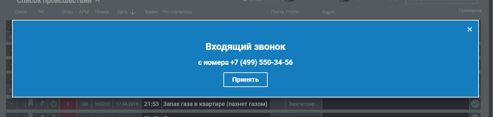

# Интерфейсные окна

| № | Окно | Описание | Администратор | Преподаватель | Обучающийся |
|----------|----------|------------------------|----------|----------|----------|
| 1 | Окно входа в систему | Аутентификация в локальном контуре | + | + | + |
| 2 | Личный кабинет **Администратора** (дашборд) | Сводка по объектам приложения | + | - | - |
| 3 | Личный кабинет **Преподавателя** (дашборд) | Сводка по занятиям, прогрессу обучения | - | + | - |
| 4 | Личный кабинет **Обучающегося** (дашборд) | Сводка по занятиям, прогрессу обучения | - | - | + |
| 5 | Список учебных сценариев | Перечень всех имеющихся учебных сценариев -- их создание, удаление, подтверждение | + | + | - |
| 6 | Учебный сценарий: Тема + список учебных задач | Учебные задачи выбираются из списка имеющихся | - | + | - |
| 7 | Список учебных задач | Перечень всех имеющихся учебных задач | - | + | - |
| 8 | Учебная задача (диспозиция+эталон) | Редактирование учебной задачи. Ее подтверждение. Включает исходные данные (сообщение заявителя) и эталонное оформление Карточки-112, сложность, тайминг (по умолчанию 30 сек), критерии успешности а также прочие данные -- дату создания и т.д.. (Возможен ввод вручную или генерация при помощи ИИ) | - | + | - |
| 9 | Список обучающихся (Для преподавателя) | Перечень всех обучающихся имеющихся в системе | - | + | - |
| 10 | Список тренировок | Перечень всех имеющихся `тренировок` -- их создание, удаление. Подготовлены/Активные/Завершенные. Преподаватель и администратор видят все. Обучающийся видит только назначенные ему. Если тренировка активна и еще не пройдена, появляется кнопка *Пройти* при нажатии на нее Обучающийся переходит в `Эмулятор АРМ-112`. | + | + | + |
| 11 | **Тренировка** (перечень учебных сценариев входящих в тренировку, перечень обучающихся задействованных в тренировке, список заполненных в ходе тренировки учебных карточек) | Редактирование тренировки.  | + | + | - |
| 12 | Список Пользователей | Перечень всех пользователей системы -- добавление, удаление, назначение ролей. | + | - | - |
| 13 | Карточка Пользователя | Редактирование карточки пользователя. ФИО и прочие данные. Права. | + | - | - |
| 14 | **Карточка происшествия** (<span style="color:red">имитация интерфейса системы АРМ-112</span>) | Карточка события заполняемая обучаемым (имитация выполнения действий при получении сообщения Оператором-112 в системе-112). Среди данных обязательно есть идентификатор `Учебной задачи`, для того, чтобы можно было определить какие исходные данные были получены пользователем и каков эталонный ответ. Если карточка заполнена и нажато принять, изменить ее уже нельзя. | - | - | + |
| 15 | Список всех учебных карточек (большой) | Список всех `учебных карточек` заполненных `обучающимися`. Можно фильтровать по пользователю, дате тренировки, категории и т.д. | + | + | + |
| 16 | Отчёты и аналитика | Отчёты по успеваемости, статистика обучения, инсайты ИИ по типичным ошибкам группы, экспорт (CSV/PDF) | + | + | + |
| 17 | **Эмулятор АРМ-112**: приём вызова | Принятие входящего вызова/сообщения в режиме обучения (виртуальная IP-телефония или текстовые сообщения). При входе `Обучающемуся` начинают выдаваться учебные задачи одна за одной в виде `карточек происшествий`, которые ему в соответствии с регламентом действий службы-112 следует заполнять. Ведется общий учет времени и прогресс, а также иные метрики тренировки. | + | + | + |
| 18 | Справочная база (методические материалы) | Просмотр инструкций, памяток («Работа на АРМ-112»), материалов по уровням сложности | + | + | + |
| 19 | Панель мониторинга системы | Состояние всех компонентов в реальном времени, нагрузка на сервер, показатели работоспособности | + | - | - |
| 20 | Конфигурация взаимодействия с БД | Настройка подключения к PostgreSQL, параметры резервирования | + | - | - |
| 21 | Настройки безопасности и RBAC | Политики безопасности, правила доступа, контроль целостности, принцип минимальных привилегий | + | - | - |
| 22 | Управление резервным копированием | Настройка расписания (не реже 1 раза в сутки), ручные копии, восстановление | + | - | - |
| 23 | Настройки журналирования | Параметры логов, хранение журналов безопасности не менее 6 месяцев | + | - | - |
| 24 | Системные журналы | Просмотр логов событий, ошибок и сбоев | + | - | + |
| 25 | Статистика использования системы | Анализ загрузки, отчёты об ошибках и сбоях | + | - | - |
| 26 | Аудит безопасности | Журнал действий пользователей, контроль инцидентов | + | - | - |
| 27 | Обновление программного обеспечения | Пакетное обновление ПО учебного комплекса | + | - | - |
| 28 | Список `Группы происшествий` | Просмотр списка возможных групп происшествий | + | - | - |
| 29 | Сведения о `Группе происшествий` | Возможные значения Признаков 1, 2 и 3. Перечень дополнительных полей. Редактирование `Группы происшествий` | + | - | - |
| 30 | Параметры ИИ | Настройка параметров подключения ИИ |
| 31 | Статусы сценариев | Редактирование списка статусов сценариев |
| 32 | Статусы заявителя | Редактирование списка статусов заявителей |
| 33 | Адреса | Структура адресов: Страна, Субъект, Населенный пункт, Объект |
| 34 | Службы | Редактирование списка служб |
| 35 | Роли обучающихся | Роли назначаемые обучающимся при проведении `тренировок`. Может быть: `Оператор-112`, `Диспетчер ДДС` или `Диспетчер службы` (одной из `служб` (34)) |


# Описание окон

## Окно входа в систему

Вход в систему. Предназначено для приветствия пользователей и авторизации.


Элементы:
- Поля
    - Логин
    - Пароль
- Кнопки
    - Вход

После ввода логина и пароля, пользователь попадает в свой личный кабинет.

## Личный кабинет (2-4)

Личный кабинет пользователя. Содержание окна может меняться в зависимости от роли пользователя. Имеется меню перехода к другим окнам.

### Системный администратор

Элементы:
- Меню (кнопки):
    - `Настройки ИИ`
    - `Настройки БД`
    - `Панель мониторинга системы`
    - `Резервное копирование`
    - `Журналирование`
    - `Аудит безопасности`
    - `Обновление программного обеспечения`

### Администратор

Элементы:
- Меню (кнопки) Администрирование:
    - `Пользователи`
    - `Список групп событий`
    - `Сведения о группе событий`
    - `Сценарии действия пользователей с окнами`
    - `Методические материалы`

- Меню (кнопки) Контроль:
    - `Тренировки`
    - `Сценариии`
    - `Учебные карточки`
    - `Ответы`

### Преподаватель

Элементы:
- Меню (кнопки):
    - `Тренировки`
    - `Сценариии`
    - `Учебные карточки`
    - `Обучающиеся`
    - `Ответы`
    - `Методические материалы`

### Пользователь

Элементы:
- Меню (кнопки):
    - `Мои тренировки`
    - `Ответы`
    - `Методические материалы`


## Учебные сценарии (5)

Содержит список всех имеющихся учебных сценариев

| Роль          | Просмотр | Изменение | Добавление | Удаление |
| ------------- | -------- | --------- | ---------- | -------- |
| Администратор | + | - | - | - |
| Преподаватель | + | - | - | - |
| Обучающийся   | - | - | - | - |

## Учебный сценарий (6)

Окно содержащее полный набор сведений об учебном сценарии.

Каждый сценарий может входить в несколько `тренировок`.

| Роль          | Просмотр | Изменение | Добавление | Удаление |
| ------------- | -------- | --------- | ---------- | -------- |
| Администратор | + | + | + | + |
| Преподаватель | + | + | + | + |
| Обучающийся   | - | - | - | - |

Элементы:
- Поля
    - Тема: Строка
    - Кто создал: id_Пользователя
    - Кто утвердил: id_Пользователя
    - Дата создания: Дата
    - Статус: Элемент списка `Статусы сценариев` (31)
    - Описание: Текстовое поле
- Кнопки
    - Сохранить
    - Отмена
    - Удалить
- Списки
    - `Учебные задачи` (добавление/удаление из списка существующих)


## Список учебных задач (7)

Список всех существующих учебных задач. При выборе элемента из списка можно перейти к окну с конкретной учебной задачей. 

Имеется фильтр задач (по дате, типу происшествия, сценарию). Имеется поиск по сообщению.

| Роль          | Просмотр | Изменение | Добавление | Удаление |
| ------------- | -------- | --------- | ---------- | -------- |
| Администратор | + | - | - | - |
| Преподаватель | + | - | - | - |
| Обучающийся   | + | - | - | - |


## Учебная задача (8)

Основной элемент тренажера.

Содержит диспозицию (исходный текст сообщения от заявителя) и Эталон - пример заполненной `Карточки происшествия` (14) (копию набора данных `карточки`(14)).

Каждая `Учебная задача` может входить в один или несколько `Учебных сценариев`

Элементы:
- Поля
    - id: long (скрытое)
    - Сообщение заявителя: Строка
    - Телефон (АОН): Строка
    - Телефон (Предоставленный): Строка
    - Телефон (На место): Строка
    - ФИО заявителя: Строка
    - Статус заявителя: `Статус заявителя` (32)
    - Адрес:
        - Координаты: Широта,Долгота (скрытое)
        - Страна: Строка[100]
        - Субъект: Строка[100]
        - Населенный пункт: Строка[100]
        - Объект: Строка[200]
        - Округ: Строка[100]
        - Район: Строка[100]
        - Улица: Строка[100]
        - Дом: Строка[20]
        - Корпус: Строка[20]
        - Строение: Строка[20]
        - Квартира: Строка[10]
        - Подъезд: Строка[10]
        - Этаж: Строка[10]
        - Код: Строка[20]
        - Описательный адрес: Строка
    - Описание со слов заявителя: Строка[2000]
    - Пострадавшие: Да/Нет
    - Нет на месте/Отказ от скорой: Да/Нет
    - Нет доступа/Заблаговременно (на место): Да/Нет
    - Нет контакта: Да/Нет
    - Срыв звонка: Да/Нет
    - Тип происшествия:
        - `Группа происшествий`(28)
        - `Признак 1`
        - `Признак 2`
        - `Признак 3`
        - Прочие поля: опционально исходя из `группы происшествий` (28)
    - Основная служба: `Службы`(34)
    - Список привлекаемых служб: `Службы`(34)

| Роль          | Просмотр | Изменение | Добавление | Удаление |
| ------------- | -------- | --------- | ---------- | -------- |
| Администратор | + | + | + | + |
| Преподаватель | + | + | + | + |
| Обучающийся   | - | - | - | - |


## Список обучающихся (9)

Список всех обучающихся. Имеется фильтр и поиск.

| Роль          | Просмотр | Изменение | Добавление | Удаление |
| ------------- | -------- | --------- | ---------- | -------- |
| Администратор | + | + | + | + |
| Преподаватель | + | - | - | - |
| Обучающийся   | + | - | - | - |


## Список тренировок (10)

Список всех существующих `Тренировок`. При выборе элемента из списка можно перейти к окну с конкретной `Тренировкой`. 

Имеется фильтр тренировок. Имеется поиск.

| Роль          | Просмотр | Изменение | Добавление | Удаление |
| ------------- | -------- | --------- | ---------- | -------- |
| Администратор | + | - | - | - |
| Преподаватель | + | - | - | - |
| Обучающийся   | + | - | - | - |


## Тренировка (11)

Каждая тренировка содержит несколько `Учебных сценариев`

Свойства самой тренировки: название, дата, сложность и т.д.. Заголовок, дата, перечень учебных сценариев, перечень задействованных обучающихся. Если тренировка завершена изменить ее уже нельзя. Статусы меняются: Подготовленная -\> Активная -\> Завершена. Для активной тренировки в режиме реального времени отображается прогресс обучающихся (сколько выполнено учебных задач, сколько из них верно, среднее время ответа и т.д. ) -- Это наверное лучше отдельным списком сделать


Элементы:
- Поля
    - id: long (скрытое)
    - Название: Строка[100]
    - Описание: Строка[2000]
    - Дата начала: Дата
    - Дата окончания: Дата
    - Сложность: [Низкая, Средняя, Высокая, Адаптивная] (или от 1 до 5, Адаптивная)
    - Режим: [Обучение, Тестирование]
    - Состояние: Подготовленная, Активная, Завершенная
    - Список `Учебных сценариев`: `Учебные сценарии`(33)
    - Список `Обучающихся` назначенных для тренировки: `Обучающиеся`(12) + `Роли-112` (35)
    - Назначенные `учебные задания`, их статус: `Карточка` (14)

*прим.* -- Адаптивная степень сложности подразумевает, что сложность предлагаемых обучающемуся  `Учебных заданий` определяется исходя из того насколько успешно пользователь отвечает.

В режиме обучения система подсказывает `обучаемому` В какие поля какие данные следует вносить. Если пользователь больше 5 секунд ничего не делает, появляются подсказки в виде попапов у полей.

| Роль          | Просмотр | Изменение | Добавление | Удаление |
| ------------- | -------- | --------- | ---------- | -------- |
| Администратор | + | + | + | + |
| Преподаватель | + | + | + | + |
| Обучающийся   | + | - | - | - |


## Список Пользователей (12)

При выборе одного из пользователей можно перейти в `Карточку пользователя` (13)

Список всех обучающихся. Имеется фильтр и поиск.

| Роль          | Просмотр | Изменение | Добавление | Удаление |
| ------------- | -------- | --------- | ---------- | -------- |
| Администратор | + | + | + | + |
| Преподаватель | - | - | - | - |
| Обучающийся   | - | - | - | - |


## Карточка пользователя (13)

Сведения о пользователе

Элементы:
- Поля
    - id: long (скрытое)
    - Фамилия: Строка
    - Имя: Строка
    - Отчество: Строка
    - Телефон: Строка
    - email: Строка
    - логин: Строка
    - пароль: Строка

| Роль          | Просмотр | Изменение | Добавление | Удаление |
| ------------- | -------- | --------- | ---------- | -------- |
| Администратор | + | + | + | + |
| Преподаватель | - | - | - | - |
| Обучающийся   | - | - | - | - |


## Карточка происшествия (14)

<small><span style="color:red">имитация интерфейса системы АРМ-112</span></small>

Карточка события заполняемая обучаемым (имитация выполнения действий при получении сообщения Оператором-112 в системе-112). Среди данных обязательно есть идентификатор `Учебной задачи`, для того, чтобы можно было определить какие исходные данные были получены пользователем и каков эталонный ответ. Если карточка заполнена и нажато принять, изменить ее уже нельзя.

Элементы:
- Поля
    - id: long (скрытое)
    - id учебной задачи: long (скрытое)
    - Телефон (АОН): Строка
    - Телефон (Предоставленный): Строка
    - Телефон (На место): Строка
    - ФИО заявителя: Строка
    - Статус заявителя: `Статус заявителя` (32)
    - Адрес:
        - Координаты: Широта,Долгота (скрытое)
        - Страна: Строка[100]
        - Субъект: Строка[100]
        - Населенный пункт: Строка[100]
        - Объект: Строка[200]
        - Округ: Строка[100]
        - Район: Строка[100]
        - Улица: Строка[100]
        - Дом: Строка[20]
        - Корпус: Строка[20]
        - Строение: Строка[20]
        - Квартира: Строка[10]
        - Подъезд: Строка[10]
        - Этаж: Строка[10]
        - Код: Строка[20]
        - Описательный адрес: Строка
    - Описание со слов заявителя: Строка[2000]
    - Пострадавшие: Да/Нет
    - Нет на месте/Отказ от скорой: Да/Нет
    - Нет доступа/Заблаговременно (на место): Да/Нет
    - Нет контакта: Да/Нет
    - Срыв звонка: Да/Нет
    - Тип происшествия:
        - `Группа происшествий`(28)
        - `Признак 1`
        - `Признак 2`
        - `Признак 3`
        - Прочие поля: опционально исходя из `группы происшествий` (28)
    - Основная служба: `Службы`(34)
    - Список привлекаемых служб: `Службы`(34)
    - Оценка того, насколько точно обучающийся заполнил `Карточку`: 0-100% (машинное сравнение)
    - Оценка того, насколько точно обучающийся заполнил `Карточку` ИИ: 0-100% (Оценка ИИ)
    - Итоговая оценка: 0-100% (подтвержденная преподавателем)

Карточки создаются автоматически по мере прохождения `тренировки` в окне `Эмулятор АРМ-112`.

| Роль          | Просмотр | Изменение | Добавление | Удаление |
| ------------- | -------- | --------- | ---------- | -------- |
| Администратор | + | + | + | + |
| Преподаватель | + | - | - | - |
| Обучающийся   | + | + | - | - |


## Список всех учебных карточек (15)

Просмотр всех заполненных обучающимися карточек. Нужен для просмотра ответов и составления отчетов (по пользователю, группе, типам вопросов, тренировкам и т.д.). Может встраиваться в другие окна (с соответствующими фильтрами по необходимости) - `Рабочий стол` (2, 3, 4), `Тренировка` (11), `Карточка пользователя` (13).

| Роль          | Просмотр | Изменение | Добавление | Удаление |
| ------------- | -------- | --------- | ---------- | -------- |
| Администратор | + | - | - | - |
| Преподаватель | + | - | - | - |
| Обучающийся   | + | - | - | - |


## Отчёты и аналитика (16)

Отчёты по успеваемости, статистика обучения, инсайты ИИ по типичным ошибкам группы, экспорт (CSV/PDF)

Конкретное содержание пока не определено.

| Роль          | Просмотр | Изменение | Добавление | Удаление |
| ------------- | -------- | --------- | ---------- | -------- |
| Администратор | + | - | - | - |
| Преподаватель | + | - | - | - |
| Обучающийся   | - | - | - | - |


## Эмулятор АРМ-112 (17)

Собственно учебное окно в котором и происходит цикл выдача-заполнение карточек в рамках `Тренировки`.

Принятие входящего вызова/сообщения в режиме обучения (виртуальная IP-телефония или текстовые сообщения).

При входе `Обучающемуся` начинают выдаваться `учебные задачи` одна за одной в виде `карточек происшествий` (14), которые ему в соответствии с регламентом действий службы-112 следует заполнять. 

1. Случайным образом (на основе выбранных для тренировки сценариев и входящих в них учебных заданий, а также выбранной сложности), обучающемуся выдается учебное задание
2. Появляется кнопка "Принять вызов" (в центре экрана) и номер телефона по АОН



3. После нажатия кнопки, создается новая `Карточка` (14) и зачитывается сообщение Заявителя
4. Обучающийся сразу начинает заполнять `Карточку` (14),
    Если обучающийся не успел заполнить карточку за время отведенное настройками `тренировки`, переход к шагу 6
5. После заполнения `Карточки`, обучающийся нажимает кнопку "Сохранить" (в нижнем правом углу экрана)
6. Если обучающийся выполнил все учебные задания в соответствии с настройкой тренировки, тренировка заканчивается. Если нет -- возврат к шагу 1.


Ведется общий учет времени и прогресс, а также иные метрики тренировки.

| Роль          | Просмотр | Изменение | Добавление | Удаление |
| ------------- | -------- | --------- | ---------- | -------- |
| Администратор | + | - | - | + |
| Преподаватель | + | - | - | - |
| Обучающийся   | + | + | (auto) | - |


## Справочная база (18)

Список различного рода справочных материалов (ссылки на прикрепленные документы pdf, xlsx, docx и т.д.)

| Роль          | Просмотр | Изменение | Добавление | Удаление |
| ------------- | -------- | --------- | ---------- | -------- |
| Администратор | + | + | + | + |
| Преподаватель | + | + | + | + |
| Обучающийся   | + | - | - | - |


## Панель мониторинга системы (19)

Состояние всех компонентов в реальном времени, нагрузка на сервер, показатели работоспособности

| Роль          | Просмотр | Изменение | Добавление | Удаление |
| ------------- | -------- | --------- | ---------- | -------- |
| Администратор | + | - | - | - |
| Преподаватель | - | - | - | - |
| Обучающийся   | - | - | - | - |


## Конфигурация взаимодействия с БД (20)

Настройка подключения к PostgreSQL, параметры резервирования

| Роль          | Просмотр | Изменение | Добавление | Удаление |
| ------------- | -------- | --------- | ---------- | -------- |
| Администратор | + | + | - | - |
| Преподаватель | - | - | - | - |
| Обучающийся   | - | - | - | - |


## Настройки безопасности и RBAC (21)

Политики безопасности, правила доступа, контроль целостности, принцип минимальных привилегий

| Роль          | Просмотр | Изменение | Добавление | Удаление |
| ------------- | -------- | --------- | ---------- | -------- |
| Администратор | + | + | - | - |
| Преподаватель | - | - | - | - |
| Обучающийся   | - | - | - | - |


## Управление резервным копированием (22)

Не нужно -- реализовано в окне `Конфигурация взаимодействия с БД` (20)


## Настройки журналирования (23)

Параметры логов, хранение журналов безопасности не менее 6 месяцев

| Роль          | Просмотр | Изменение | Добавление | Удаление |
| ------------- | -------- | --------- | ---------- | -------- |
| Администратор | + | + | - | + |
| Преподаватель | - | - | - | - |
| Обучающийся   | - | - | - | - |


## Системные журналы (24)

Просмотр логов событий, ошибок и сбоев

| Роль          | Просмотр | Изменение | Добавление | Удаление |
| ------------- | -------- | --------- | ---------- | -------- |
| Администратор | + | + | - | + |
| Преподаватель | - | - | - | - |
| Обучающийся   | - | - | - | - |


## Статистика использования системы (25)

Анализ загрузки, отчёты об ошибках и сбоях

| Роль          | Просмотр | Изменение | Добавление | Удаление |
| ------------- | -------- | --------- | ---------- | -------- |
| Администратор | + | + | - | + |
| Преподаватель | - | - | - | - |
| Обучающийся   | - | - | - | - |


## Аудит безопасности (26)

Журнал действий пользователей, контроль инцидентов

Анализ загрузки, отчёты об ошибках и сбоях

| Роль          | Просмотр | Изменение | Добавление | Удаление |
| ------------- | -------- | --------- | ---------- | -------- |
| Администратор | + | + | - | + |
| Преподаватель | - | - | - | - |
| Обучающийся   | - | - | - | - |


## Обновление программного обеспечения (27)

Пакетное обновление ПО учебного комплекса

| Роль          | Просмотр | Изменение | Добавление | Удаление |
| ------------- | -------- | --------- | ---------- | -------- |
| Администратор | + | + | - | + |
| Преподаватель | - | - | - | - |
| Обучающийся   | - | - | - | - |


## Список `Группы происшествий` (28)

Просмотр списка возможных групп происшествий


## Сведения о `Группе происшествий` (29)

Возможные значения Признаков 1, 2 и 3. Перечень дополнительных полей. Редактирование `Группы происшествий`


## Параметры ИИ (30)

Настройка параметров подключения ИИ 


## Статусы сценариев (31) 

Редактирование списка статусов сценариев


## Статусы заявителя (32) 

Редактирование списка статусов заявителей


## Адреса (33)

Не понятно -- нужно ли. Пока не делать!

Структура адресов: Страна, Субъект, Населенный пункт, Объект

## Службы (34)

Редактирование списка служб.

Элементы:
- Поля:
    - id: 
    - Название: Строка
    - Описание: Строка


## Роли обучающихся (35)

*Вряд ли нужно - роли `Оператор-112`, `Диспетчер ДДС` жестко заданы. Прочие можно взять из списка `Службы` (34)*

Роли назначаемые обучающимся при проведении `тренировок`. Может быть: `Оператор-112`, `Диспетчер ДДС` или `Диспетчер службы` (одной из `служб` (34))


# Сценарии действия пользователей с окнами

## Сценарий 1. Настройка системы

Пользователь заходит с ролью "Администратор".

```{mermaid}
flowchart TD
    A[1 Вход]
    B[2 Кабинет администратора]
    C[12-13 Пользователи и роли]
    D[28-35 Справочники]
    E[20-23 БД, RBAC, журналирование]
    F[19,25,26 Мониторинг и аудит]
    
    A --> B
    B --> C
    B --> D
    B --> E
    B --> F
```

1. **Вход в систему** (окно 1). Администратор вводит логин/пароль и попадает в свой личный кабинет (окно 2).
2. **Управление пользователями** (окна 12, 13): создание пользователей, заполнение карточки (ФИО, контакты, логин, пароль), назначение ролей — Администратор, Преподаватель, Обучающийся.
3. **Заполнение нормативно-справочной базы** (окна 28-35):
   - Группы происшествий (окно 28) и сведения о группе (окно 29): значения Признаков 1, 2, 3 и перечень дополнительных полей.
   - Службы (окно 34): перечень служб экстренного реагирования.
   - Статусы сценариев (окно 31) и статусы заявителей (окно 32).
   - Адреса (окно 33) и Роли обучающихся (окно 35) — при необходимости.
4. **Настройка подключения к БД** (окно 20) — параметры PostgreSQL и резервирования (окно 22 реализовано в составе этого окна).
5. **Настройки безопасности и RBAC** (окно 21) — политики доступа по принципу минимальных привилегий.
6. **Настройки журналирования** (окно 23) — параметры логов и сроков хранения; просмотр системных журналов (окно 24).
7. **Параметры ИИ** (окно 30) — настройка подключения ИИ (используется для генерации учебных задач и оценки карточек).
8. **Контроль работоспособности** — панель мониторинга системы (окно 19), статистика использования (окно 25), аудит безопасности (окно 26), обновление ПО (окно 27).
9. Настройка завершена. Ограничение: пока не заведены пользователи и не наполнены справочники (окна 28-34), преподаватель не может создать полноценную учебную задачу (окно 8), а значит недоступны и учебные сценарии (окна 5-6).


## Сценарий 2. Настройка учебной среды

Пользователь заходит с ролью "Преподаватель". Цель — подготовить учебные задачи, собрать из них учебные сценарии и сформировать тренировку.

```{mermaid}
flowchart LR
    A[1 Вход] --> B[3 Кабинет преподавателя]
    B --> C[8 Учебная задача - диспозиция и эталон]
    C --> D[7 Список учебных задач]
    D --> E[6 Учебный сценарий - тема и задачи]
    E --> F[5 Список учебных сценариев]
    F --> G[11 Тренировка - сценарии, обучающиеся, роли]
    G --> H[10 Активная тренировка]
```

1. **Вход** (окно 1) и переход в кабинет преподавателя (окно 3).
2. **Создание учебных задач** (окно 8): заполнение диспозиции (сообщение заявителя, телефон, адрес, пострадавшие, тип происшествия и признаки) и эталона — эталонной Карточки происшествия (окно 14). Задача подтверждается, задаются сложность, тайминг и критерии успешности. Данные можно ввести вручную или сгенерировать с помощью ИИ (окно 30). Список задач доступен в окне 7.
3. **Сборка учебного сценария** (окно 6): указывается тема, из списка существующих (окно 7) добавляются учебные задачи, назначается статус из справочника (окно 31). Сценарий утверждается. Просмотр всех сценариев — окно 5.
4. **Формирование тренировки** (окно 11): задаются название, даты, сложность (в т.ч. адаптивная), режим (Обучение/Тестирование); в тренировку включаются несколько учебных сценариев; назначаются обучающиеся (окно 9) с ролями из справочника (окно 35) — Оператор-112, Диспетчер ДДС, Диспетчер службы.
5. **Методические материалы** (окно 18) — при необходимости пополняется справочная база, доступная обучающемуся на занятии.
6. **Активация**: тренировка переводится из состояния "Подготовленная" в "Активная" и становится видна назначенным обучающимся в списке тренировок (окно 10).
7. Ограничение: в тренировку (окно 11) можно включать только утвержденные учебные сценарии (окно 6), а в сценарий — только подтвержденные учебные задачи (окно 8).

## Сценарий 3. Проведение практического занятия на АРМ-112 (Оператор-112, карточки)

Пользователь заходит с ролью "Обучающийся". Цель — отработать приём вызова и заполнение Карточки происшествия.

```{mermaid}
flowchart LR
    A[1 Вход] --> B[4 Кабинет обучающегося]
    B --> C[10 Список тренировок]
    C --> D[17 Эмулятор АРМ-112: принять вызов]
    D --> E[14 Карточка происшествия - заполнение]
    E --> F{Успеваю за тайминг}
    F -- Да --> G[Сохранить и сверить с эталоном]
    F -- Нет --> H[Автоматическое сохранение]
    G --> I[Следующая учебная задача]
    H --> I
    I --> J[15,16 Просмотр результатов]
```

1. **Вход** (окно 1). Обучающийся попадает в личный кабинет (окно 4) и видит назначенные ему тренировки в списке (окно 10).
2. **Старт тренировки**: если тренировка активна и ещё не пройдена, в окне 10 доступна кнопка "Пройти" — открывается Эмулятор АРМ-112 (окно 17).
3. **Приём вызова** (окно 17): на основе сценариев тренировки и выбранной сложности случайно выдаётся учебная задача; появляется кнопка "Принять вызов" и номер АОН.
4. **Заполнение карточки** (окно 14): после нажатия "Принять вызов" создаётся новая Карточка происшествия и зачитывается сообщение заявителя. Обучающийся заполняет поля (телефоны, адрес, пострадавшие, тип происшествия и признаки, службы) в соответствии с регламентом. Карточка хранит id учебной задачи (окно 8) для последующего сравнения с эталоном.
5. **Сохранение**: по завершении обучающийся нажимает "Сохранить". После нажатия "Принять" изменить карточку нельзя. Если отведённое тренировкой время вышло — переход к следующей задаче.
6. **Оценка**: карточка сравнивается с эталоном (машинное сравнение 0-100% и оценка ИИ); итоговая оценка подтверждается преподавателем.
7. **Завершение цикла**: когда выполнены все учебные задания согласно настройкам тренировки, она завершается; иначе — возврат к шагу 3. Ведётся учёт времени и прогресса.
8. **Результаты**: просмотр заполненных карточек — окно 15, отчёты и аналитика — окно 16. Преподаватель в реальном времени видит прогресс в окне тренировки (окно 11).
9. Ограничение: старт невозможен, если тренировка (окно 10) не находится в состоянии "Активная" и не назначена данному обучающемуся (окно 11).

## Сценарий 4. Проведение практического занятия на АРМ-112 (Диспетчер-112, действия с карточками)

Пользователь заходит с ролью "Обучающийся" с ролью на тренировке "Диспетчер ДДС"/"Диспетчер службы" (окно 35). Цель — отработать действия диспетчера с уже заведённой Карточкой происшествия: маршрутизацию сил и служб, сопровождение и закрытие.

```{mermaid}
flowchart LR
    A[1 Вход] --> B[4 Кабинет обучающегося]
    B --> C[10 Список тренировок]
    C --> D[17 Эмулятор АРМ-112]
    D --> E[14 Карточка происшествия от Оператора-112]
    E --> F[Назначение служб и сил]
    F --> G{Решение корректно}
    G -- Да --> H[Сопровождение и закрытие карточки]
    G -- Нет --> I[Подсказка / снижение оценки]
    H --> J[Следующая карточка]
    I --> F
    J --> K[15,16 Результаты]
```

1. **Вход** (окно 1), кабинет обучающегося (окно 4), выбор активной тренировки в списке (окно 10), открытие Эмулятора АРМ-112 (окно 17) — как в сценарии оператора.
2. **Получение карточки**: обучающемуся-диспетчеру поступает Карточка происшествия (окно 14), уже сформированная по сообщению заявителя, с типом происшествия и признаками (окна 28-29).
3. **Действия с карточкой** (окно 14): диспетчер назначает основную и привлекаемые службы (окно 34), при необходимости уточняет статус заявителя (окно 32), отмечает реагирование и сопровождение, закрывает карточку.
4. **Контроль корректности**: решения сверяются с эталоном учебной задачи (окно 8); некорректные назначения служб/признаков снижают машинную и ИИ-оценку карточки. В режиме обучения доступны подсказки (окно 11).
5. **Завершение цикла**: после обработки всех карточек в рамках настроек тренировки она завершается. Ведётся учёт времени и метрик.
6. **Результаты**: просмотр карточек — окно 15, отчёты — окно 16; преподаватель наблюдает прогресс в окне 11.
7. Ограничение: действия с карточками доступны только внутри активной тренировки (окна 10-11); вне занятия карточки доступны лишь для просмотра (окно 15).


## Сценарий 5. Проведение занятий в режиме имитационного моделирования.


