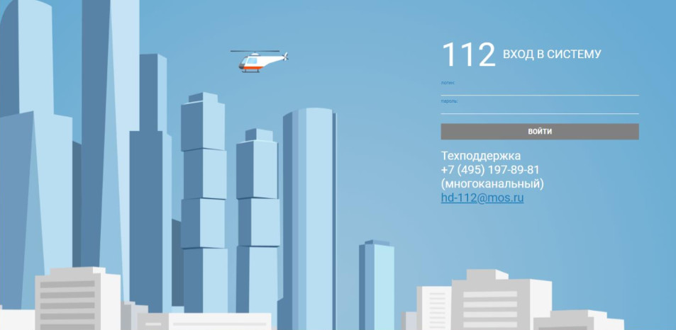

# Интерфейсные окна

| № | Окно | Описание | Администратор | Преподаватель | Обучающийся |
|----------|----------|------------------------|----------|----------|----------|
| 1 | Окно входа в систему | Аутентификация в локальном контуре | + | + | + |
| 2 | Личный кабинет **Администратора** (дашборд) | Сводка по объектам приложения | + | - | - |
| 3 | Личный кабинет **Преподавателя** (дашборд) | Сводка по занятиям, прогрессу обучения | - | + | - |
| 4 | Личный кабинет **Обучающегося** (дашборд) | Сводка по занятиям, прогрессу обучения | - | - | + |
| 5 | Список учебных сценариев | Перечень всех имеющихся учебных сценариев -- их создание, удаление, подтверждение | + | + | - |
| 6 | Учебный сценарий: Тема + список учебных задач | Учебные задачи выбираются из списка имеющихся | - | + | - |
| 7 | Список учебных задач | Перечень всех имеющихся учебных задач | - | + | - |
| 8 | Учебная задача (диспозиция+эталон) | Редактирование учебной задачи. Ее подтверждение. Включает исходные данные (сообщение заявителя) и эталонное оформление Карточки-112, сложность, тайминг (по умолчанию 30 сек), критерии успешности а также прочие данные -- дату создания и т.д.. (Возможен ввод вручную или генерация при помощи ИИ) | - | + | - |
| 9 | Список обучающихся (Для преподавателя) | Перечень всех обучающихся имеющихся в системе | - | + | - |
| 10 | Список тренировок | Перечень всех имеющихся `тренировок` -- их создание, удаление. Подготовлены/Активные/Завершенные. Преподаватель и администратор видят все. Обучающийся видит только назначенные ему. Если тренировка активна и еще не пройдена, появляется кнопка *Пройти* при нажатии на нее Обучающийся переходит в `Эмулятор АРМ-112`. | + | + | + |
| 11 | **Тренировка** (перечень учебных сценариев входящих в тренировку, перечень обучающихся задействованных в тренировке, список заполненных в ходе тренировки учебных карточек) | Редактирование тренировки. Свойства самой тренировки: название, дата, сложность и т.д.. Заголовок, дата, перечень учебных сценариев, перечень задействованных обучающихся. Если тренировка завершена изменить ее уже нельзя. Статусы меняются: Подготовленная -\> Активная -\> Завершена. Для активной тренировки можно в режиме реального времени отображается прогресс обучающихся (сколько выполнено учебных задач, сколько из них верно, среднее время ответа и т.д. ) -- Это наверное лучше отдельным списком сделать | + | + | - |
| 12 | Список Пользователей | Перечень всех пользователей системы -- добавление, удаление, назначение ролей. | + | - | - |
| 13 | Карточка Пользователя | Редактирование карточки пользователя. ФИО и прочие данные. Права. | + | - | - |
| 14 | **Карточка происшествия** (имитация интерфейса системы АРМ-112) | Карточка события заполняемая обучаемым (имитация выполнения действий при получении сообщения Оператором-112 в системе-112). Среди данных обязательно есть идентификатор `Учебной задачи`, для того, чтобы можно было определить какие исходные данные были получены пользователем и каков эталонный ответ. Если карточка заполнена и нажато принять, изменить ее уже нельзя. | - | - | + |
| 15 | Список всех учебных карточек (большой) | Список всех `учебных карточек` заполненных `обучающимися`. Можно фильтровать по пользователю, дате тренировки, категории и т.д. | + | + | + |
| 16 | Отчёты и аналитика | Отчёты по успеваемости, статистика обучения, инсайты ИИ по типичным ошибкам группы, экспорт (CSV/PDF) | + | + | + |
| 17 | **Эмулятор АРМ-112**: приём вызова | Принятие входящего вызова/сообщения в режиме обучения (виртуальная IP-телефония или текстовые сообщения). При входе `Обучающемуся` начинают выдаваться учебные задачи одна за одной в виде `карточек происшествий`, которые ему в соответствии с регламентом действий службы-112 следует заполнять. Ведется общий учет времени и прогресс, а также иные метрики тренировки. | + | + | + |
| 18 | Справочная база (методические материалы) | Просмотр инструкций, памяток («Работа на АРМ-112»), материалов по уровням сложности | + | + | + |
| 19 | Панель мониторинга системы | Состояние всех компонентов в реальном времени, нагрузка на сервер, показатели работоспособности | + | - | - |
| 20 | Конфигурация взаимодействия с БД | Настройка подключения к PostgreSQL, параметры резервирования | + | - | - |
| 21 | Настройки безопасности и RBAC | Политики безопасности, правила доступа, контроль целостности, принцип минимальных привилегий | + | - | - |
| 22 | Управление резервным копированием | Настройка расписания (не реже 1 раза в сутки), ручные копии, восстановление | + | - | - |
| 23 | Настройки журналирования | Параметры логов, хранение журналов безопасности не менее 6 месяцев | + | - | - |
| 24 | Системные журналы | Просмотр логов событий, ошибок и сбоев | + | - | + |
| 25 | Статистика использования системы | Анализ загрузки, отчёты об ошибках и сбоях | + | - | - |
| 26 | Аудит безопасности | Журнал действий пользователей, контроль инцидентов | + | - | - |
| 27 | Обновление программного обеспечения | Пакетное обновление ПО учебного комплекса | + | - | - |
| 28 | Список `Группы происшествий` | Просмотр списка возможных групп происшествий | + | - | - |
| 29 | Сведения о `Группе происшествий` | Возможные значения Признаков 1, 2 и 3. Перечень дополнительных полей. Редактирование `Группы происшествий` | + | - | - |
| 30 | Параметры ИИ | Настройка параметров подключения ИИ |
| 31 | Статусы сценариев | Редактирование списка статусов сценариев |
| 32 | Статусы заявителя | Редактирование списка статусов заявителей |
<!-- | 33 | Адреса | Структура адресов: Страна, Субъект, Населенный пункт, Объект | -->
| 34 | Службы | Редактирование списка служб |

# Описание окон

## Окно входа в систему

Вход в систему. Предназначено для приветствия пользователей и авторизации.

Элементы:
- Поля
    - Логин
    - Пароль
- Кнопки
    - Вход

После ввода логина и пароля, пользователь попадает в свой личный кабинет.

## Личный кабинет (2-4)

Личный кабинет пользователя. Содержание окна может меняться в зависимости от роли пользователя. Имеется меню перехода к другим окнам.

### Системный администратор

Элементы:
- Меню (кнопки):
    - `Настройки ИИ`
    - `Настройки БД`
    - `Панель мониторинга системы`
    - `Резервное копирование`
    - `Журналирование`
    - `Аудит безопасности`
    - `Обновление программного обеспечения`

### Администратор

Элементы:
- Меню (кнопки) Администрирование:
    - `Пользователи`
    - `Список групп событий`
    - `Сведения о группе событий`
    - `Сценарии действия пользователей с окнами`
    - `Методические материалы`

- Меню (кнопки) Контроль:
    - `Тренировки`
    - `Сценариии`
    - `Учебные карточки`
    - `Ответы`

### Преподаватель

Элементы:
- Меню (кнопки):
    - `Тренировки`
    - `Сценариии`
    - `Учебные карточки`
    - `Обучающиеся`
    - `Ответы`
    - `Методические материалы`

### Пользователь

Элементы:
- Меню (кнопки):
    - `Мои тренировки`
    - `Ответы`
    - `Методические материалы`

## Учебные сценарии (5)

Содержит список всех имеющихся учебных сценариев

| Роль          | Просмотр | Изменение | Добавление | Удаление |
| ------------- | -------- | --------- | ---------- | -------- |
| Администратор | + | - | - | - |
| Преподаватель | + | - | - | - |
| Обучающийся   | - | - | - | - |

## Учебный сценарий (6)

Окно содержащее полный набор сведений об учебном сценарии.

| Роль          | Просмотр | Изменение | Добавление | Удаление |
| ------------- | -------- | --------- | ---------- | -------- |
| Администратор | + | + | + | + |
| Преподаватель | + | + | + | + |
| Обучающийся   | - | - | - | - |

Элементы:
- Поля
    - Тема: Строка
    - Кто создал: id_Пользователя
    - Кто утвердил: id_Пользователя
    - Дата создания: Дата
    - Статус: Элемент списка `Статусы сценариев` (31)
    - Описание: Текстовое поле
- Кнопки
    - Сохранить
    - Отмена
    - Удалить
- Списки
    - `Учебные задачи` (добавление/удаление из списка существующих)

## Список учебных задач (7)

Список всех существующих учебных задач. При выборе элемента из списка можно перейти к окну с конкретной учебной задачей. 

Имеется фильтр задач (по дате, типу происшествия, сценарию). Имеется поиск по сообщению.

| Роль          | Просмотр | Изменение | Добавление | Удаление |
| ------------- | -------- | --------- | ---------- | -------- |
| Администратор | + | - | - | - |
| Преподаватель | + | - | - | - |
| Обучающийся   | + | - | - | - |

## Учебная задача (8)

Основной элемент тренажера.

Содержит диспозицию (исходный текст сообщения от заявителя) и Эталон - пример заполненной `Карточки происшествия` (14) (копию набора данных `карточки`(14)).

Каждая `Учебная задача` может входить в один или несколько `Учебных сценариев`

Элементы:
- Поля
    - id: long (скрытое)
    - Сообщение заявителя: Строка
    - Телефон (АОН): Строка
    - Телефон (Предоставленный): Строка
    - Телефон (На место): Строка
    - ФИО заявителя: Строка
    - Статус заявителя: `Статус заявителя` (32)
    - Адрес:
        - Координаты: Широта,Долгота (скрытое)
        - Страна: Строка[100]
        - Субъект: Строка[100]
        - Населенный пункт: Строка[100]
        - Объект: Строка[200]
        - Округ: Строка[100]
        - Район: Строка[100]
        - Улица: Строка[100]
        - Дом: Строка[20]
        - Корпус: Строка[20]
        - Строение: Строка[20]
        - Квартира: Строка[10]
        - Подъезд: Строка[10]
        - Этаж: Строка[10]
        - Код: Строка[20]
        - Описательный адрес: Строка
    - Описание со слов заявителя: Строка[2000]
    - Пострадавшие: Да/Нет
    - Нет на месте/Отказ от скорой: Да/Нет
    - Нет доступа/Заблаговременно (на место): Да/Нет
    - Нет контакта: Да/Нет
    - Срыв звонка: Да/Нет
    - Тип происшествия:
        - `Группа происшествий`(28)
        - `Признак 1`
        - `Признак 2`
        - `Признак 3`
        - Прочие поля: опционально исходя из `группы происшествий` (28)
    - Основная служба: `Службы`(34)
    - Список привлекаемых служб: `Службы`(34)

| Роль          | Просмотр | Изменение | Добавление | Удаление |
| ------------- | -------- | --------- | ---------- | -------- |
| Администратор | + | + | + | + |
| Преподаватель | + | + | + | + |
| Обучающийся   | - | - | - | - |

## Список обучающихся (9)

Список всех обучающихся. Имеется фильтр и поиск.

| Роль          | Просмотр | Изменение | Добавление | Удаление |
| ------------- | -------- | --------- | ---------- | -------- |
| Администратор | + | + | + | + |
| Преподаватель | + | - | - | - |
| Обучающийся   | + | - | - | - |

## Список тренировок (10)

## Список Пользователей (12)

При выборе одного из пользователей можно перейти в `Карточку пользователя` (13)

Список всех обучающихся. Имеется фильтр и поиск.

| Роль          | Просмотр | Изменение | Добавление | Удаление |
| ------------- | -------- | --------- | ---------- | -------- |
| Администратор | + | + | + | + |
| Преподаватель | - | - | - | - |
| Обучающийся   | - | - | - | - |

## Карточка пользователя (13)

Сведения о пользователе

Элементы:
- Поля
    - id: long (скрытое)
    - Фамилия: Строка
    - Имя: Строка
    - Отчество: Строка
    - Телефон: Строка
    - email: Строка
    - логин: Строка
    - пароль: Строка

| Роль          | Просмотр | Изменение | Добавление | Удаление |
| ------------- | -------- | --------- | ---------- | -------- |
| Администратор | + | + | + | + |
| Преподаватель | - | - | - | - |
| Обучающийся   | - | - | - | - |

# Сценарии действия пользователей с окнами

